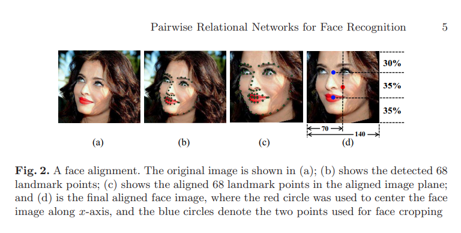

# 人脸转正

目前实现了的face_align方式：

1. by_landmarks：根据关键点 landmarks 进行人脸转正
   1. affine_trans：利用关键点之间的对应关系进行仿射变换。
   2. prn_method：Pairwise Relational Networks 论文中的转正方式
2. by_bbox：仅根据检出的人脸框进行转正
   1. affine_trans：根据人脸框的四个角点和模板的对应关系进行仿射变换。

## by_landmarks

### affine_trans

参数：

- template：

  - 支持以下三种类型的输入：

    - dict：单个模板，包含 left_eye, right_eye, nose_tip, left_mouth_corner, right_mouth_corner 等键和对应的2d坐标点值。

    - list of dict：包含多个模板的列表。会尝试匹配 template 参数给定的多个关键点模板，选取拟合程度最佳的模板的结果作为最终结果。

    - str：采用默认模板。目前支持以下可选值：
      - arcface：单个模板，来自[arcface相关代码](https://github.com/deepinsight/insightface/blob/master/recognition/arcface_mxnet/common/face_align.py)
      - arcface_with_chin：单个模板，在arcface的基础上对y轴坐标-8，从而把下巴包含进来。
      - insightface ：5个模板，来自[insightface相关代码](https://github.com/deepinsight/insightface/blob/master/recognition/arcface_mxnet/common/face_align.py)
      - insightface_with_chin：在insightface的基础上对y轴坐标-8，从而把下巴包含进来。

- template_face_size：模板中对应的人脸大小。

- desired_face_size：希望输出的图片中人脸的大小。

- 其余与控制图像大小和人脸在图片中的位置的参数：desired_image_size、padding_ls

- mode：采用何种匹配模式。目前支持以下几种模式：

  1. eyes_nose_mouth：利用双眼、鼻尖、两个嘴角的5个关键点进行仿射变换。

       - 模板需要包含 left_eye, right_eye, nose_tip, left_mouth_corner, right_mouth_corner。

       - 对大角度人脸，建议选用insightface的template。

  2. eye2eye：利用双眼，进行旋转和缩放。

     - 模板需要包含 left_eye, right_eye。
     - 对pitch大角度人脸适应良好，但不宜用于yaw大角度人脸。

  3. eyes2mouth：利用两眼连线中心点和嘴巴中心点，进行旋转和缩放。

       - 模板需要包含 left_eye, right_eye, left_mouth_corner, right_mouth_corner。

       - 对yaw大角度人脸适应良好，但不宜用于pitch大角度人脸。

  4. eye2eye_or_eyes2mouth：根据双眼距离和眼睛到嘴的距离的比例，选择是采用 eye2eye 还是 eyes2mouth 模式

       - 模板需要包含 left_eye, right_eye, left_mouth_corner, right_mouth_corner。

       - 当双眼距离明显大于眼睛到嘴的距离时，认为系pitch大角度人脸，采用 eye2eye 模式。

       - 当眼睛到嘴的距离明显大于双眼距离时，认为系yaw大角度人脸，采用 eyes2mouth 模式。

#### arcface预处理方式

实现效果与[官方源码](https://github.com/deepinsight/insightface/blob/master/recognition/arcface_mxnet/common/face_align.py)相同。

#### insightface预处理方式

### prn_method

- 先旋转人脸至眼睛连线水平，然后计算最左最右关键点的中点和眼嘴连线中点，分别取这两个中点的x坐标和y坐标构造一个新的点作为人脸的中心点，然后按照给定比例进行padding和裁剪。
- 具体可以参看https://zhuanlan.zhihu.com/p/55426921中介绍。

1. 检测68个关键点
2. 旋转人脸，使得双眼水平，从而对齐人脸
3. 找到最靠左和最靠右关键点的中点（下图红点），该点确定了裁剪后图片在x轴（宽度）方向的中心位置。
4. 分别找到双眼、嘴唇关键点的中点（下图蓝点），这两点确定了裁剪后图片在y轴（高度）方向上三部分的位置。
5. 裁剪图片至140x140。

## by_bbox

### affine_trans

参数

- template：
  - 与 by_landmarks 的 affine_trans() 中的 template 参数一样，同样支持三种类型的输入。
  - 模板中应该包含4个角点的位置，依次为`[(x_min,y_min),(x_min,y_max),(x_max,y_min),(x_max,y_max)]`。
  - 默认模板，目前支持以下可选值：
    - edge_corner：最边缘的四个角点。
    - vggface2：从边缘往内缩进一定距离的四个角点。
- mode：采用何种匹配模式，目前支持以下几种模式：
  1. raw_bbox：采用原始人脸框的四个角点。
  2. expanded_bbox：在原始人脸框上，以人脸框中心点为中心点，最长边为边长，画一个正方形，采用该正方形的四个角点。

#### VGGFace2预处理方式

参考vggface2论文中的IV. DATASET COLLECTION==>C. Stage 3: Face detection部分，具体是使用MTCNN出人脸框，然后在这个框基础上扩展0.3倍，然后取最长边为正方形，crop下来，再resize到指定大小。

要实现vggface2论文中的转正方式，有以下三种参数组合：

- mode="expanded_bbox"，template="vggface2"
- mode="expanded_bbox"，template="edge_corner"，padding_ls=0.15
- mode="expanded_bbox"，template="edge_corner"，desired_image_size=1.3

参考：

1. [【论文】Pairwise Relational Networks for Face Recognition](https://arxiv.org/abs/1808.04976)
1. [【论文】VGGFace2: A dataset for recognising faces across pose and age](https://arxiv.org/pdf/1710.08092)
1. [【博客】人脸检测与对齐python实现](https://zhuanlan.zhihu.com/p/55479744)
1. [【博客】Pairwise Relational Networks 论文](https://zhuanlan.zhihu.com/p/55426921)
1. [【博客】人脸对齐几种常见方法代码整理](https://zhuanlan.zhihu.com/p/371335681)

