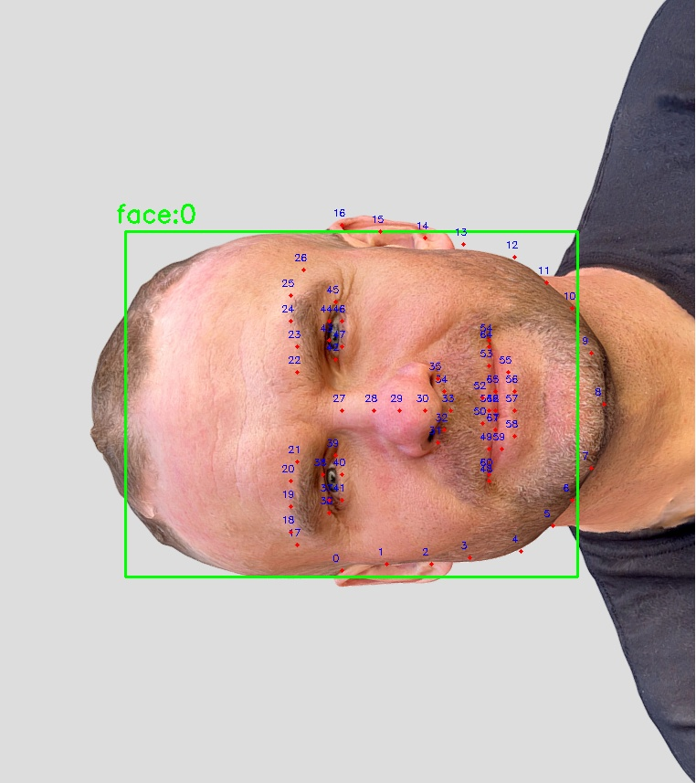

# summary of SFD_Detector

## detect_face()

检出图片中的人脸框和关键点。

### 单人脸（关键点示意图）

|  | 原图 | 带关键点和人脸框 | 关键点标准图 |
| --- | --- | --- | --- |
| image |  |  |  |

### 多人脸

|  | 原图 | 带关键点和人脸框 |
| --- | --- | --- |
| image |  |  |

### 不同 head pose 下的人脸检测

人头模型数据来自：Head scan 13 (photogrammetry) by yaro.pro on Sketchfab，遵守 CC BY 4.0 DEED 协议。

 <iframe title="Head scan 13 (photogrammetry)" frameborder="0" allowfullscreen mozallowfullscreen="true" webkitallowfullscreen="true" allow="autoplay; fullscreen; xr-spatial-tracking" xr-spatial-tracking execution-while-out-of-viewport execution-while-not-rendered web-share src="https://sketchfab.com/models/5e6d2804405449e6b3bd96cd12d8b1ab/embed"> </iframe> 
 <a href="https://sketchfab.com/3d-models/head-scan-13-photogrammetry-5e6d2804405449e6b3bd96cd12d8b1ab?utm_medium=embed&utm_campaign=share-popup&utm_content=5e6d2804405449e6b3bd96cd12d8b1ab" target="_blank" rel="nofollow" style="font-weight: bold; color: #1CAAD9;"> Head scan 13 (photogrammetry) </a> by <a href="https://sketchfab.com/yaro.pro?utm_medium=embed&utm_campaign=share-popup&utm_content=5e6d2804405449e6b3bd96cd12d8b1ab" target="_blank" rel="nofollow" style="font-weight: bold; color: #1CAAD9;"> yaro.pro </a> on <a href="https://sketchfab.com?utm_medium=embed&utm_campaign=share-popup&utm_content=5e6d2804405449e6b3bd96cd12d8b1ab" target="_blank" rel="nofollow" style="font-weight: bold; color: #1CAAD9;">Sketchfab</a>

#### pitch

| pose | -60 | -30 | 0 | 30 | 60 |
| --- | --- | --- | --- | --- | --- |
| raw_image |  |  |  |  |  |
| detect_image |  |  |  |  |  |
| detect_res | [{'bbox': [224.59259796142578, 305.4945945739746, 588.7370071411133, 733.8363609313965], 'landmarks': '[[225.0, 452.0... ], [251.0, 534.0... ], [225.0, 465.0... ], [238.0, 496.0... ], [244.0, 522.0... ], [270.0, 573.0... ], [295.0, 617.0... ], [352.0, 680.0... ]... ]', 'score': 0.5471127}] | [{'bbox': [263.09885478019714, 218.1140537261963, 628.3770225048065, 721.5521335601807], 'landmarks': '[[240.0, 350.0... ], [247.0, 385.0... ], [254.0, 419.0... ], [268.0, 447.0... ], [282.0, 496.0... ], [303.0, 552.0... ], [330.0, 600.0... ], [379.0, 656.0... ]... ]', 'score': 0.770358}] | [{'bbox': [237.6365566253662, 165.63628005981445, 594.7722072601318, 663.8421211242676], 'landmarks': '[[220.0, 372.0... ], [227.0, 426.0... ], [234.0, 474.0... ], [241.0, 516.0... ], [255.0, 563.0... ], [282.0, 598.0... ], [309.0, 618.0... ], [344.0, 639.0... ]... ]', 'score': 0.8296561}] | [{'bbox': [294.3220977783203, 45.692216873168945, 618.5161895751953, 436.74595832824707], 'landmarks': '[[264.0, 294.0... ], [270.0, 328.0... ], [275.0, 357.0... ], [281.0, 386.0... ], [298.0, 414.0... ], [327.0, 420.0... ], [350.0, 420.0... ], [379.0, 414.0... ]... ]', 'score': 0.8211294}] | [{'bbox': [339.2389621734619, 67.45202445983887, 649.4710483551025, 296.82386589050293], 'landmarks': '[[310.0, 260.0... ], [310.0, 264.0... ], [314.0, 282.0... ], [314.0, 290.0... ], [332.0, 308.0... ], [358.0, 308.0... ], [388.0, 295.0... ], [414.0, 277.0... ]... ]', 'score': 0.7414894}] |

#### roll

| pose | -150 | -120 | -90 | -30 | -15 | 0 | 15 | 30 | 90 | 120 | 150 | 180 |
| --- | --- | --- | --- | --- | --- | --- | --- | --- | --- | --- | --- | --- |
| raw_image |  |  |  |  |  |  |  |  |  |  |  |  |
| detect_image |  |  |  |  |  |  |  |  |  |  |  |  |
| detect_res | [{'bbox': [361.55697298049927, 273.8817024230957, 782.0569729804993, 802.6406745910645], 'landmarks': '[[750.0, 455.0... ], [735.0, 417.0... ], [712.0, 379.0... ], [682.0, 356.0... ], [644.0, 311.0... ], [590.0, 288.0... ], [545.0, 273.0... ], [491.0, 280.0... ]... ]', 'score': 0.6993024}] | [{'bbox': [319.9087791442871, 347.56109619140625, 774.2279319763184, 736.7317199707031], 'landmarks': '[[651.0, 377.0... ], [611.0, 356.0... ], [563.0, 343.0... ], [523.0, 329.0... ], [476.0, 323.0... ], [428.0, 329.0... ], [394.0, 343.0... ], [354.0, 363.0... ]... ]', 'score': 0.7729749}] | [{'bbox': [145.1419906616211, 236.83113384246826, 616.6230087280273, 627.3236265182495], 'landmarks': '[[391.0, 222.0... ], [342.0, 222.0... ], [294.0, 229.0... ], [246.0, 243.0... ], [197.0, 257.0... ], [163.0, 285.0... ], [135.0, 312.0... ], [108.0, 354.0... ]... ]', 'score': 0.7909538}] | [{'bbox': [343.3679885864258, 333.5604944229126, 741.1365127563477, 787.1303796768188], 'landmarks': '[[388.0, 427.0... ], [368.0, 468.0... ], [347.0, 516.0... ], [334.0, 557.0... ], [320.0, 604.0... ], [320.0, 652.0... ], [334.0, 693.0... ], [354.0, 727.0... ]... ]', 'score': 0.78745633}] | [{'bbox': [314.5403633117676, 270.86702728271484, 678.1208381652832, 750.1025619506836], 'landmarks': '[[317.0, 415.0... ], [303.0, 469.0... ], [303.0, 517.0... ], [297.0, 557.0... ], [297.0, 611.0... ], [317.0, 652.0... ], [337.0, 685.0... ], [364.0, 712.0... ]... ]', 'score': 0.792472}] | [{'bbox': [237.6365566253662, 165.63628005981445, 594.7722072601318, 663.8421211242676], 'landmarks': '[[220.0, 372.0... ], [227.0, 426.0... ], [234.0, 474.0... ], [241.0, 516.0... ], [255.0, 563.0... ], [282.0, 598.0... ], [309.0, 618.0... ], [344.0, 639.0... ]... ]', 'score': 0.8296561}] | [{'bbox': [314.67376708984375, 278.86833572387695, 684.9395141601562, 752.1725959777832], 'landmarks': '[[320.0, 529.0... ], [334.0, 577.0... ], [354.0, 617.0... ], [367.0, 658.0... ], [395.0, 705.0... ], [428.0, 725.0... ], [469.0, 745.0... ], [503.0, 752.0... ]... ]', 'score': 0.7919848}] | [{'bbox': [348.18130683898926, 334.10405373573303, 743.868745803833, 813.6555368900299], 'landmarks': '[[388.0, 639.0... ], [409.0, 681.0... ], [437.0, 716.0... ], [465.0, 758.0... ], [507.0, 793.0... ], [549.0, 807.0... ], [591.0, 814.0... ], [626.0, 807.0... ]... ]', 'score': 0.7809968}] | [{'bbox': [137.41360092163086, 253.5995979309082, 632.958309173584, 631.4243965148926], 'landmarks': '[[374.0, 624.0... ], [423.0, 617.0... ], [472.0, 617.0... ], [514.0, 610.0... ], [570.0, 603.0... ], [605.0, 575.0... ], [626.0, 547.0... ], [647.0, 512.0... ]... ]', 'score': 0.76614106}] | [{'bbox': [317.02276039123535, 387.9751434326172, 777.7446231842041, 778.6659698486328], 'landmarks': '[[625.0, 737.0... ], [673.0, 710.0... ], [707.0, 683.0... ], [741.0, 655.0... ], [782.0, 621.0... ], [803.0, 580.0... ], [810.0, 546.0... ], [810.0, 505.0... ]... ]', 'score': 0.7608877}] | [{'bbox': [374.1079397201538, 315.0881540775299, 762.8540029525757, 830.7336008548737], 'landmarks': '[[724.0, 659.0... ], [746.0, 616.0... ], [767.0, 565.0... ], [775.0, 536.0... ], [796.0, 485.0... ], [789.0, 442.0... ], [775.0, 398.0... ], [760.0, 362.0... ]... ]', 'score': 0.65837294}] | [{'bbox': [250.30224609375, 113.38580703735352, 633.3739929199219, 692.626163482666], 'landmarks': '[[268.0, 298.0... ], [268.0, 337.0... ], [268.0, 383.0... ], [268.0, 414.0... ], [268.0, 476.0... ], [283.0, 514.0... ], [299.0, 537.0... ], [299.0, 560.0... ]... ]', 'score': 0.2477127}] |

#### yaw

| pose | -90 | -60 | -30 | 0 | 30 | 60 | 90 |
| --- | --- | --- | --- | --- | --- | --- | --- |
| raw_image |  |  |  |  |  |  |  |
| detect_image |  |  |  |  |  |  |  |
| detect_res | [{'bbox': [525.9445362091064, 143.57666397094727, 764.5273761749268, 599.3387794494629], 'landmarks': '[[497.0, 341.0... ], [503.0, 391.0... ], [514.0, 430.0... ], [525.0, 469.0... ], [547.0, 503.0... ], [581.0, 530.0... ], [625.0, 542.0... ], [670.0, 547.0... ]... ]', 'score': 0.8435331}] | [{'bbox': [361.87077713012695, 94.16238021850586, 716.7591743469238, 637.7683982849121], 'landmarks': '[[341.0, 333.0... ], [355.0, 390.0... ], [362.0, 441.0... ], [377.0, 484.0... ], [406.0, 527.0... ], [456.0, 556.0... ], [506.0, 570.0... ], [571.0, 585.0... ]... ]', 'score': 0.8564292}] | [{'bbox': [347.9239158630371, 106.00074005126953, 707.2512168884277, 617.4004592895508], 'landmarks': '[[321.0, 338.0... ], [335.0, 387.0... ], [349.0, 436.0... ], [370.0, 485.0... ], [391.0, 534.0... ], [440.0, 568.0... ], [489.0, 589.0... ], [552.0, 603.0... ]... ]', 'score': 0.83989155}] | [{'bbox': [237.6365566253662, 165.63628005981445, 594.7722072601318, 663.8421211242676], 'landmarks': '[[220.0, 372.0... ], [227.0, 426.0... ], [234.0, 474.0... ], [241.0, 516.0... ], [255.0, 563.0... ], [282.0, 598.0... ], [309.0, 618.0... ], [344.0, 639.0... ]... ]', 'score': 0.8296561}] | [{'bbox': [253.68697929382324, 81.3804759979248, 611.6182231903076, 596.3807201385498], 'landmarks': '[[254.0, 301.0... ], [240.0, 357.0... ], [247.0, 399.0... ], [254.0, 441.0... ], [268.0, 497.0... ], [289.0, 532.0... ], [303.0, 560.0... ], [317.0, 574.0... ]... ]', 'score': 0.8534344}] | [{'bbox': [131.31988716125488, 87.17000102996826, 451.9650592803955, 581.4659910202026], 'landmarks': '[[164.0, 297.0... ], [144.0, 350.0... ], [138.0, 389.0... ], [144.0, 434.0... ], [151.0, 474.0... ], [144.0, 519.0... ], [144.0, 532.0... ], [157.0, 552.0... ]... ]', 'score': 0.8657216}] | [{'bbox': [147.09491539001465, 75.91587352752686, 452.0275020599365, 589.1894330978394], 'landmarks': '[[204.0, 300.0... ], [184.0, 346.0... ], [184.0, 385.0... ], [178.0, 425.0... ], [178.0, 457.0... ], [171.0, 497.0... ], [171.0, 516.0... ], [184.0, 529.0... ]... ]', 'score': 0.85745347}] |

## find_best_rotate_angle()

选取检出的分数最高的人脸，计算出要将图片旋转多少角度，才能让该人脸竖直。

| raw_image |  |  |  |
| --- | --- | --- | --- |
| detect_image |  |  |  |
| rotate_angle | 269.34253630377367 | 336.3948001843144 | 38.76166820448782 |
| rotated_image |  |  |  |

