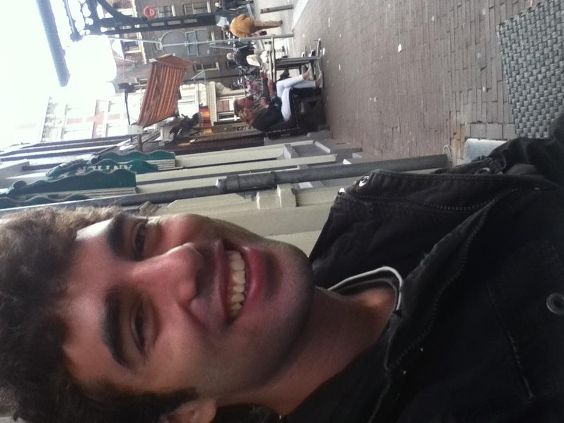
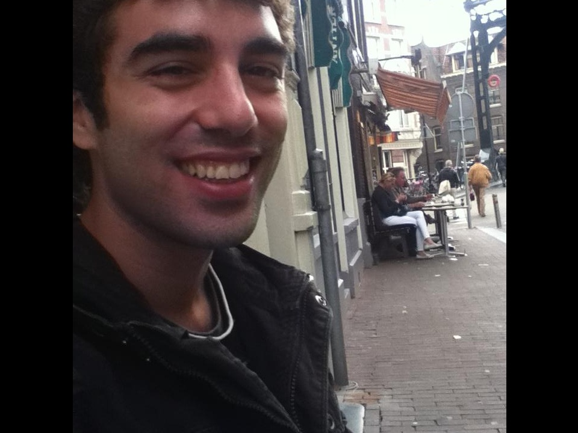

# summary of rotation calculation in mtcnn_detector

分析 MTCNN_Detector 中的 find_best_rotate_angle() 是如何通过调用 evaluate_scores_at_diff_rotate_angles()计算出旋转角度的。

## 函数介绍

find_best_rotate_angle():

```python
find_best_rotate_angle():

            找出图像的最佳旋转角度
        
```

evaluate_scores_at_diff_rotate_angles():

```python
rotate_image():

            在不同角度下获取最佳人脸分数

            参数：
                base_angles:        <list of angle>
                step:               <float>
                range_:             [st, ed]
                        将依次以 base_angles 中的每个 base_angle 角度为中心，按照step的步长，在base_angle+range_[0]到range_+range[1]的范围内，
                        检测图像，并返回最高得分的旋转角度。包头包尾。
                known_res_s:        <dict> 已有的结果
                                    结构为：
                                    {
                                        <angle>:{
                                            "score": <float>,
                                            ...
                                        }
                                    }
                                    若需要检测的角度在 known_res_s 中已经存在，则直接返回其中的结果，实现加速。
                decimals:           <int> 角度值的精度（保留多少位小数）
                b_get_fine_angle:   <boolean> 是否通过高斯平滑，获取精细角度
        
```

## 计算流程

下面演示 find_best_rotate_angle() 内部是如何多次调用 evaluate_scores_at_diff_rotate_angles() 迭代获取最佳旋转角度。分为以下几步：- 取原图0°、旋转±45°、±90°、±135°和180°下检测分数最大的角度，记为$$\alpha_{0}$$。
- 以$$\alpha_{0}$$为基础，以15°为步长，在$$\alpha_{0}-45$$和$$\alpha_{0}+45$$之间检测，同样取分数最大的角度，记为$$\alpha_{1}$$。（若$$\alpha_{0}$$为空，亦即上一步无法检测出人脸，则令$$\alpha_{0}$$依次等于上面的四个角度，分别尝试得出最佳的$$\alpha_{1}$$。）
- 以$$\alpha_{1}$$为基础，以5°为步长，在$$\alpha_{0}-15$$和$$\alpha_{0}+15$$之间检测，同样取分数最大的角度，记为$$\alpha_{2}$$。
- 以$$\alpha_{2}$$为基础，以1°为步长，在$$\alpha_{0}-5$$和$$\alpha_{0}+5$$之间检测，使用 kernel=5，sigma=1 的高斯卷积核对分数进行平滑，同样取分数最大的角度（精确到0.1°），记为$$\alpha_{3}$$。即为最佳角度。
input image:



| paras | {'base_angles': None, 'range_': (-180, 180), 'step': 45, 'b_get_fine_angle': False, 'known_res_s': '...;len(known_res_s) is 0'} | {'base_angles': [270.0], 'range_': (-45, 45), 'step': 15, 'b_get_fine_angle': False, 'known_res_s': '...;len(known_res_s) is 8'} | {'base_angles': [270.0], 'range_': (-15, 15), 'step': 5, 'b_get_fine_angle': False, 'known_res_s': '...;len(known_res_s) is 12'} | {'base_angles': [270.0], 'range_': (-5, 5), 'step': 1, 'b_get_fine_angle': True, 'known_res_s': '...;len(known_res_s) is 16'} |
| --- | --- | --- | --- | --- |
| outputs | {'best_angle': 270.0, 'res_s': '...;len(res_s) is 8'} | {'best_angle': 270.0, 'res_s': '...;len(res_s) is 7'} | {'best_angle': 270.0, 'res_s': '...;len(res_s) is 7'} | {'best_angle': 269.0, 'res_s': '...;len(res_s) is 11'} |
| rotated_image |  |  |  |  |


input image:


| paras | {'base_angles': None, 'range_': (-180, 180), 'step': 45, 'b_get_fine_angle': False, 'known_res_s': '...;len(known_res_s) is 0'} | {'base_angles': [315.0], 'range_': (-45, 45), 'step': 15, 'b_get_fine_angle': False, 'known_res_s': '...;len(known_res_s) is 8'} | {'base_angles': [330.0], 'range_': (-15, 15), 'step': 5, 'b_get_fine_angle': False, 'known_res_s': '...;len(known_res_s) is 12'} | {'base_angles': [330.0], 'range_': (-5, 5), 'step': 1, 'b_get_fine_angle': True, 'known_res_s': '...;len(known_res_s) is 16'} |
| --- | --- | --- | --- | --- |
| outputs | {'best_angle': 315.0, 'res_s': '...;len(res_s) is 8'} | {'best_angle': 330.0, 'res_s': '...;len(res_s) is 7'} | {'best_angle': 330.0, 'res_s': '...;len(res_s) is 7'} | {'best_angle': 329.2, 'res_s': '...;len(res_s) is 11'} |
| rotated_image |  |  |  |  |


input image:


| paras | {'base_angles': None, 'range_': (-180, 180), 'step': 45, 'b_get_fine_angle': False, 'known_res_s': '...;len(known_res_s) is 0'} | {'base_angles': [45.0], 'range_': (-45, 45), 'step': 15, 'b_get_fine_angle': False, 'known_res_s': '...;len(known_res_s) is 8'} | {'base_angles': [45.0], 'range_': (-15, 15), 'step': 5, 'b_get_fine_angle': False, 'known_res_s': '...;len(known_res_s) is 12'} | {'base_angles': [40.0], 'range_': (-5, 5), 'step': 1, 'b_get_fine_angle': True, 'known_res_s': '...;len(known_res_s) is 16'} |
| --- | --- | --- | --- | --- |
| outputs | {'best_angle': 45.0, 'res_s': '...;len(res_s) is 8'} | {'best_angle': 45.0, 'res_s': '...;len(res_s) is 7'} | {'best_angle': 40.0, 'res_s': '...;len(res_s) is 7'} | {'best_angle': 35.2, 'res_s': '...;len(res_s) is 11'} |
| rotated_image |  |  |  |  |


