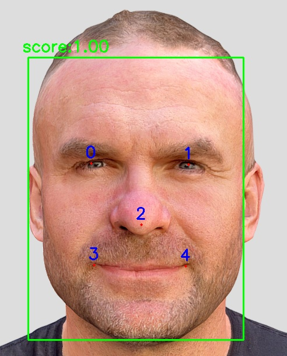
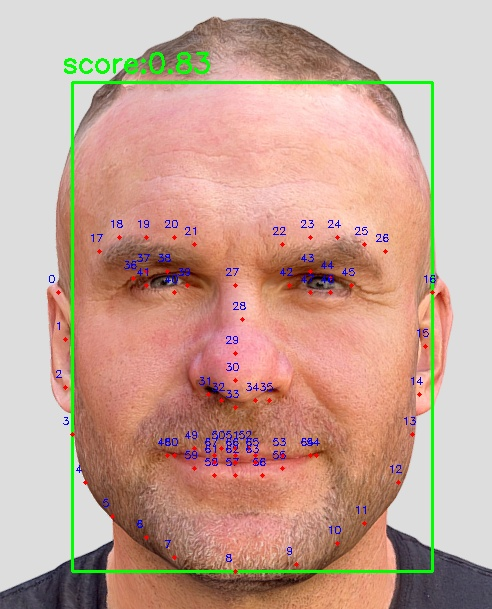
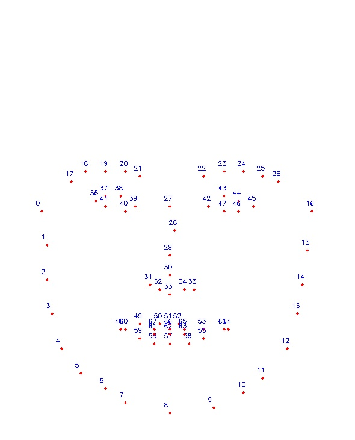
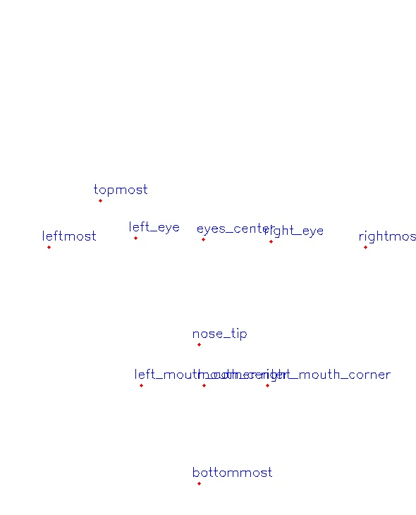

# summary of parse_landmarks

## 5关键点

|  | 原图 | 带关键点和人脸框 | 关键点标准图 | 带部位坐标 | 部位坐标标准图 |
| --- | --- | --- | --- | --- | --- |
| image |  |  |  |  |  |

## 68关键点

|  | 原图 | 带关键点和人脸框 | 关键点标准图 | 带部位坐标 | 部位坐标标准图 |
| --- | --- | --- | --- | --- | --- |
| image |  |  |  |  |  |

